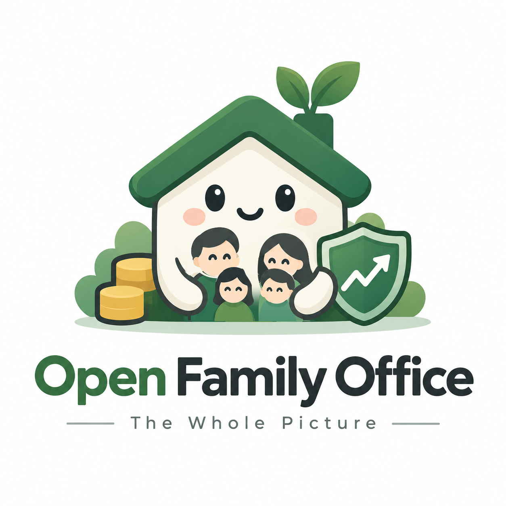
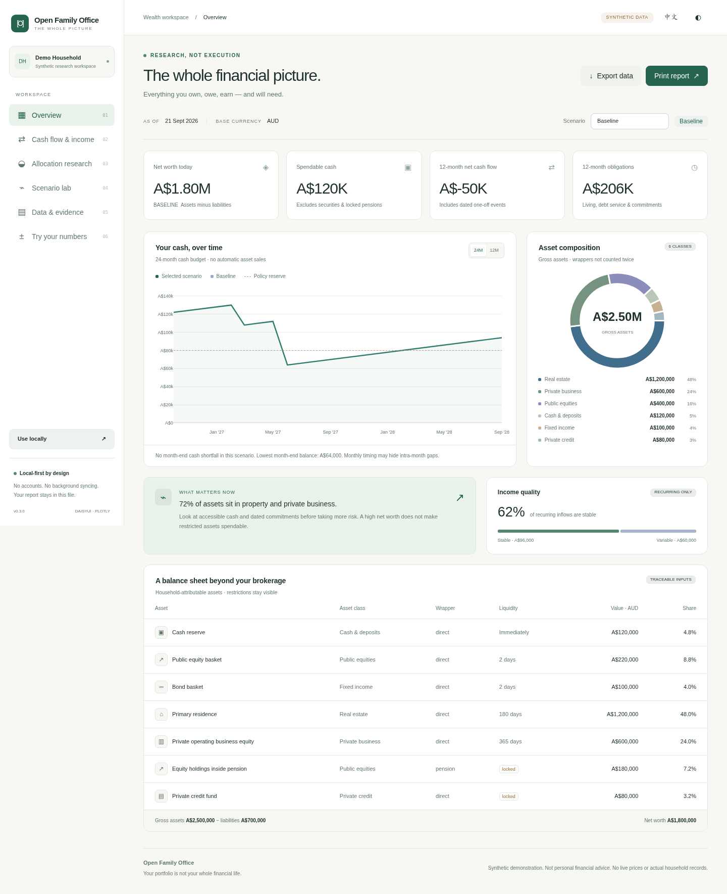
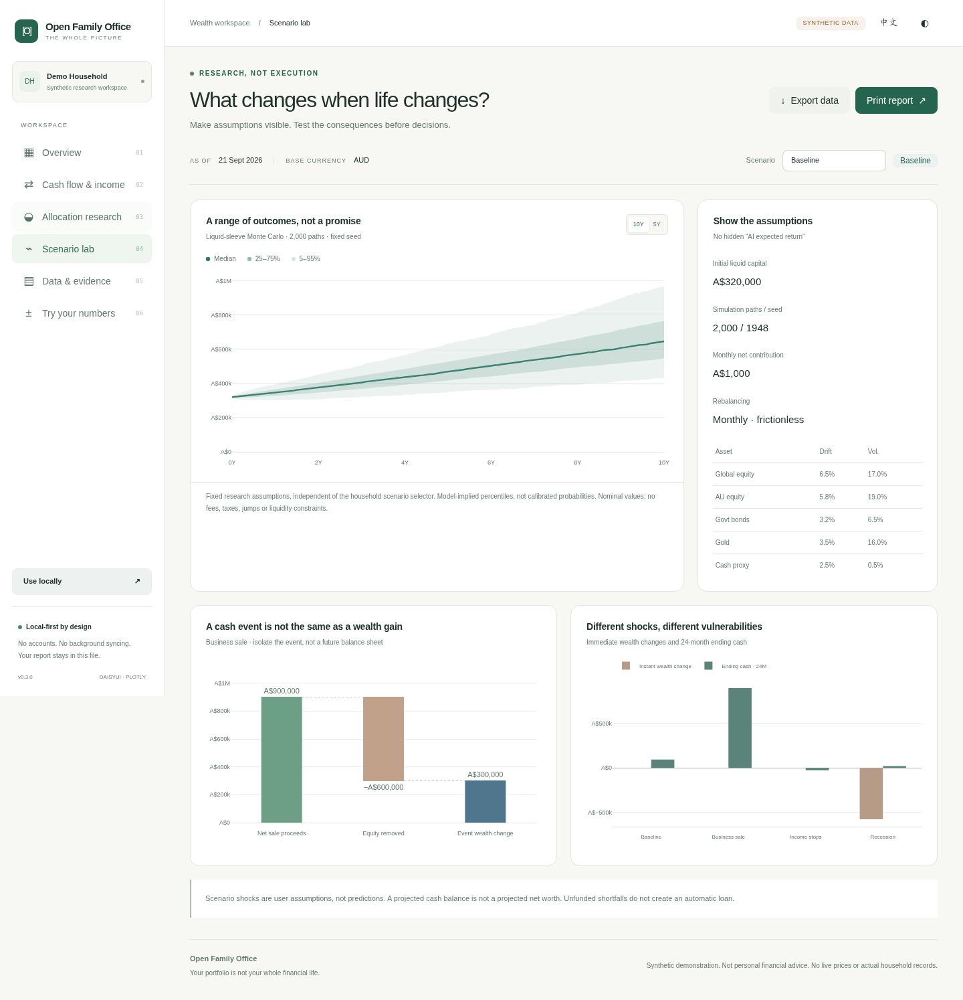

<p align="center">
  
</p>

<h1 align="center">Open Family Office</h1>

<!-- mcp-name: io.github.jamesbbbriz/open-family-office -->

<p align="center"><em>Family-office methods, open to everyone willing to own the setup.</em></p>

<p align="center">
  <a href="https://github.com/JamesbbBriz/open-family-office/actions/workflows/ci.yml"></a>
  
  
  <a href="LICENSE"></a>
  
  
  
</p>

<p align="center">
  <a href="README.zh-CN.md">中文</a> ·
  <a href="docs/QUICKSTART.md">Quick start</a> ·
  <a href="docs/AGENT-UX.md">Agent UX</a> ·
  <a href="docs/DATA-MODEL.md">Data model</a> ·
  <a href="docs/INTEGRATIONS.md">Integrations</a> ·
  <a href="ROADMAP.md">Roadmap</a>
</p>

---

**Your portfolio is not your whole financial life.** Open Family Office is a local-first, open-source family wealth research toolkit for people and AI agents. It brings assets, debt, recurring and one-off income, liquidity, ownership, goals, scenarios and a separately declared liquid investment sleeve into one household model.

It is **not a SaaS account, broker or autonomous adviser**. Advanced capability stays available — ownership look-through, Monte Carlo, optimization, provider adapters and optional MCP — while the default experience stays small and task-oriented.

## Try it in 30 seconds

If you have [uv](https://docs.astral.sh/uv/):

```bash
uvx --from git+https://github.com/JamesbbBriz/open-family-office.git ofo demo --open
```

No API key, model account or network call is needed for the synthetic demo. No Git clone or private household data is required.

## Install once, keep the data yours

```bash
uv tool install git+https://github.com/JamesbbBriz/open-family-office.git

ofo init ~/FamilyOffice
cd ~/FamilyOffice

ofo status
ofo overview --format markdown
ofo dashboard --out reports/review.html --open
```

`ofo init` creates a private workspace and installs the portable agent kit there. Open that folder in a file-aware AI agent and use **ofo-start**, or use the CLI directly.

## The whole picture

<table>
  <tr>
    <td width="50%"></td>
    <td width="50%"></td>
  </tr>
  <tr>
    <td align="center"><sub><b>Household overview</b> — net worth, spendable liquidity, asset mix and cash runway.</sub></td>
    <td align="center"><sub><b>Scenario lab</b> — business sale, income interruption and explicit stress assumptions.</sub></td>
  </tr>
</table>

The engine keeps several concepts deliberately separate:

- **net worth** vs. **spendable liquidity**;
- **recurring income** vs. **one-off receipts**;
- **current balance sheet** vs. **future cash budget**;
- **illiquid household wealth** vs. **liquid investment research**;
- **facts and evidence** vs. **assumptions and model outputs**.

A home, private company or locked pension is never silently turned into a tradable ticker.

## Skills are the UX

The default agent surface is intentionally small:

| Skill | What it is for |
|---|---|
| **ofo-demo** | Safe synthetic product tour |
| **ofo-start** | Build the first private household model |
| **ofo-update** | Add new statements, valuations or life changes |
| **ofo-overview** | Understand balance sheet, income quality and liquidity |
| **ofo-plan** | Build an investment policy and allocation framework |
| **ofo-scenario** | Test job loss, business sale, property shock or major purchases |
| **ofo-research** | Use providers, look-through and quantitative research deliberately |
| **ofo-dashboard** | Generate a private offline visual review |
| **ofo-review** | Review an earlier decision against new evidence |
| **ofo-doctor** | Diagnose installation, Skills, providers and MCP |

```text
user intent
   ↓
purposeful Skill
   ↓
canonical financial workflow
   ↓
deterministic ofo CLI / Python
   ↓
agent explanation
```

**Skills are the UX. Workflows are the financial implementation. CLI is the deterministic core. MCP is optional plumbing.**

After upgrading the CLI:

```bash
ofo agent sync
```

Unmodified managed Skills/workflows are upgraded. Files you changed yourself are reported as conflicts and **left untouched**.

## Private workspace

A normal initialized workspace looks like this:

```text
FamilyOffice/
├── household.json
├── evidence/
├── imports/
├── scenarios/
├── reports/
├── .ofo/
├── .agents/skills/
├── .claude/skills/
├── .claude/commands/
└── agent/
    ├── workflows/
    ├── methodology/
    ├── schemas/
    └── templates/
```

The CLI discovers the nearest `.ofo/workspace.json`, so normal commands stay short:

```bash
ofo validate
ofo overview
ofo scenario scenarios/business-sale.json
ofo allocation policy.json
ofo dashboard --out reports/review.html
```

Local-first does **not** mean magically encrypted or local inference. Cloud agents may receive files you explicitly let them read, and exported HTML dashboards embed their data. See [SECURITY.md](SECURITY.md).

<details>
<summary><b>Advanced research capabilities</b></summary>

### Household engine

- attributable assets and liabilities;
- recurring fixed, recurring variable and one-off cash flows;
- spendable liquidity versus locked / illiquid wealth;
- dated obligations and cash runway;
- business-sale and other event bridges;
- explicit ownership look-through and exposure dimensions;
- household investment-policy constraints.

### Quantitative research

```bash
ofo optimize returns.json --engine scipy --method min_variance
ofo simulate simulation.json
ofo lookthrough ownership.json
```

Optional engines include SciPy-based optimization, skfolio and PyPortfolioOpt bridges. Quantitative results remain conditional on supplied data and assumptions.

### Provider layer

Adapters exist for SEC EDGAR, FRED, RBA, ABS, OECD, IMF, CoinGecko, Yahoo/yfinance, OpenBB, Alpha Vantage, Finnhub, MarketData.app and MetalpriceAPI.

External retrieval is explicit:

```bash
ofo providers
ofo fetch rba table \
  --query '{"table":"f01"}' \
  --allow-network \
  --out evidence/rba-f01.json
```

Provider source code is not a claim of live entitlement or successful authentication.

### Optional MCP

MCP is not required for the project. If your host prefers standard tool calls:

```bash
uv tool install --force \
  --with 'mcp>=1.10,<2' \
  git+https://github.com/JamesbbBriz/open-family-office.git

ofo mcp-config
```

The stdio MCP server is read-only and confined to the explicitly authorized workspace.

</details>

## Architecture

```text
src/open_family_office/   installable deterministic engine + CLI
agent/workflows/          canonical financial procedures
agent/methodology/        interpretation rules
agent/schemas/            structured household inputs
.agents/skills/           canonical portable user-facing Skills
.claude/skills/           thin Claude discovery wrappers
web/src/                  daisyUI / Tailwind / Plotly source
public/                   generated landing + synthetic demo
examples/                 synthetic reproducible fixtures
tests/                    accounting, integration, quant, CLI and web tests
```

Installed wheels bundle the demo, templates, agent kit and offline web resources. A normal CLI user does **not** need a source checkout.

## Contributing

Clone the repository when you want to change the project:

```bash
git clone https://github.com/JamesbbBriz/open-family-office.git
cd open-family-office

python -m venv .venv
. .venv/bin/activate
python -m pip install -e '.[analytics,documents]'

python -m unittest discover -s tests -v
node tests/sandbox.test.cjs
python scripts/release_check.py
```

Useful contributions include jurisdiction modules, pension/super models, importers, provider fixtures, household edge cases, Skill improvements, accessibility fixes and reproducible quantitative research methods.

See [CONTRIBUTING.md](CONTRIBUTING.md).

## Project boundary

Open Family Office does not place trades, move money, log into banks, file tax returns or choose financial products on behalf of the user. It is a research and decision-support toolkit. Advanced methods are only as useful as their inputs and assumptions.

MIT licensed. Third-party components keep their own notices in [THIRD_PARTY.md](THIRD_PARTY.md).
