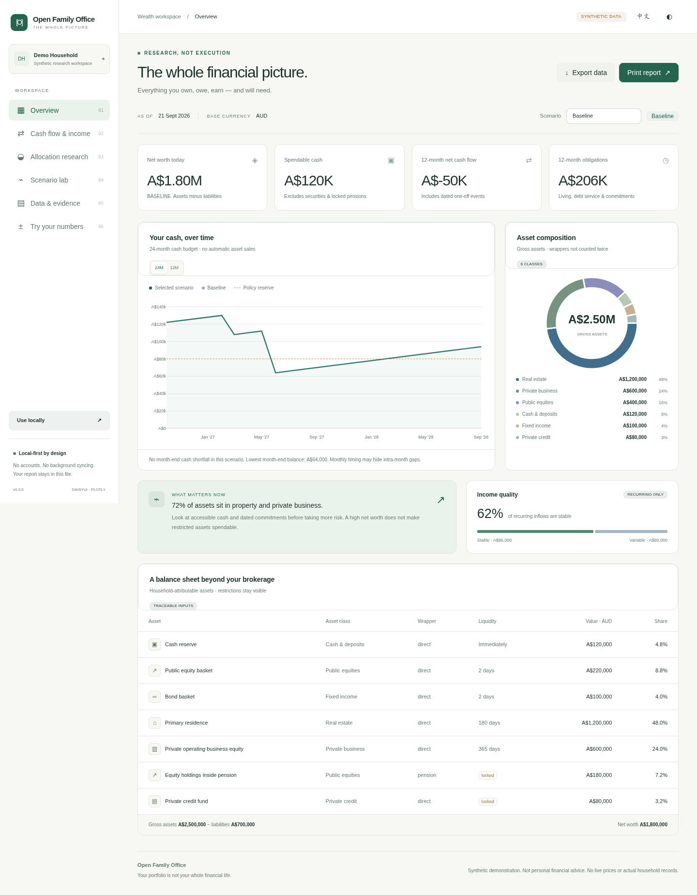

<p align="center"><strong>OPEN FAMILY OFFICE</strong><br>Your portfolio is not your whole financial life.</p>

# Open Family Office

**A local-first family wealth research workspace for AI agents.** Understand what a household owns, owes, earns and will need — then investigate liquidity, scenarios and the liquid investment sleeve. Not a stock picker, broker or autonomous adviser.

[中文](README.zh-CN.md) · [Quick start](docs/QUICKSTART.md) · [Integration coverage](docs/INTEGRATIONS.md) · [Web deployment](docs/WEB-DEPLOYMENT.zh-CN.md) · [v0.3 validation](docs/VALIDATION-v0.3.md) · [Roadmap](ROADMAP.md)


## Two pages. Two ways to start.

| Entry | What it does |
|---|---|
| **`public/index.html`** | A simple daisyUI-styled landing page, demo links, local quickstart and source-kit download. |
| **`public/demo.html`** | A self-contained interactive dashboard: 13 research charts and one independent browser calculator chart across six views. |
| **`scripts/hh.py` + agent skills** | Local household data, deterministic analysis, optional provider adapters and your own agent runtime. |

Open either HTML file locally, or publish **only `public/`** to a static host. Keep both files and `downloads/` together for relative navigation. There is no login, hosted LLM, bank connection, server database or automatic background sync.

**No live market feeds in the bundled demo.** Household examples and return histories are synthetic. The independent **Try your numbers** view recalculates a 24-month cash budget in JavaScript: starting cash, recurring income, a business-income shock, expenses, a one-off receipt and optional business sale. Inputs stay in page memory until explicitly exported; they do not replace the research fixture or drive its optimizers. Negative balances are unfunded gaps, not credit.

Compiled styles, chart scripts and example data are embedded. Browser viewing needs no Node, Python, CDN, API key or model account. Core controls are English/Chinese and light/dark. Full local AI workflows need your own runtime and its separately configured model.

## Why a household, not just a portfolio?

Selling a business can increase cash while eliminating recurring income. A pension can increase net worth while remaining unavailable for next month's bills. A family can be asset-rich and cash-constrained at the same time.

The bundled business-sale case receives A$900,000 net cash, removes a previously valued A$600,000 equity asset and stops A$5,000 monthly business distributions. Its event-only wealth change is A$300,000, not A$900,000. These are fictional inputs, not investment projections.

## One-command setup

From this extracted source checkout, use Python 3.12 and Node.js/npm:

```bash
python scripts/bootstrap.py --all
```

This installs the optional analytics, quant, market, document and MCP packages in `.venv`; installs OpenBB separately in `.venv-openbb`; builds Tailwind and the dashboard; then runs tests and a dependency check. It does not subscribe to providers, spend API credits, log into banks, enable network retrieval, publish to GitHub or deploy anything.

The full dependency resolver and native optional SDKs could not be executed in the delivery environment because package-registry access was unavailable. The installer stops on failure. Inspect [validation](docs/VALIDATION.md) rather than assuming a green installation on every OS. No complete transitive lockfile is claimed; resolved packages are recorded locally after successful installation.

```bash
# Preview setup, without installing
python scripts/bootstrap.py --all --dry-run
# Dependency-free accounting demonstration
python scripts/hh.py demo
# After installation: use .venv/bin/python (Windows: .venv\Scripts\python.exe)
.venv/bin/python scripts/hh.py doctor
.venv/bin/python scripts/hh.py providers
```

## What is implemented in v0.3?

| Layer | Implementation | Validation in this delivery |
|---|---|---|
| Household accounting | Attributable assets, debt, FX, recurring/one-off cash flows, dated commitments, disposal bridges | Real local calculations and regression tests |
| Research | SciPy minimum variance, CVaR, constrained risk-parity objective; Ledoit–Wolf covariance; efficient frontier | Real NumPy/SciPy/scikit-learn runs on synthetic inputs |
| Optional quant engines | skfolio and PyPortfolioOpt bridges; HRP and explicit-input Black–Litterman | Source included; native SDK execution not verified |
| Simulation | Correlated lognormal liquid-sleeve Monte Carlo with explicit assumptions and funding-gap tracking | Real seeded runs and numerical tests |
| Ownership and exposure | Explicit ownership DAG; separate exposure dimensions with unknowns retained | Local tests; not an inferred legal structure |
| Financial data | 13 read-only provider adapters; keys, network consent, evidence metadata and rights boundaries | Synthetic response/request contract tests; **no live-provider validation** |
| Documents | PDF text extraction; normalized holdings CSV; OFX importer | CSV and basic PDF run; OFX native execution not verified |
| Agent tools | 16 portable skills; 7-tool read-only stdio MCP server | Files and filesystem boundaries tested; real host/MCP handshake not verified |
| Interface | daisyUI MIT source-derived component subset + Tailwind + Plotly; landing, six dashboard views, 14 chart areas | Browser rendering and interaction checks; see validation limits |



### The research boundary matters

Optimizers receive a separately declared **liquid proxy research universe**. They do not silently treat a home, operating business, private fund or locked pension as a daily-tradable ticker. Cash-flow budgets, current net worth and simulated future investment values are different outputs. In-sample means, model percentiles and user-supplied views are not reliable forecasts by virtue of being plotted.

## Agent workflow

```text
hh-setup → hh-import → hh-snapshot → hh-income → hh-liquidity → hh-policy
                                               ↓
                      hh-allocate / hh-optimize / hh-simulate
                                               ↓
                        hh-what-if → hh-dashboard → hh-review
```

`hh-doctor`, `hh-source` and `hh-lookthrough` support the workflow. Start your file-aware agent at [AGENTS.md](AGENTS.md). Canonical workflows live in `workflows/`; `.agents/skills/` and `.claude/skills/` are thin pointers. Runtime discovery varies: host compatibility is not a claim that every CLI was exercised in this environment.

```bash
python scripts/hh.py optimize examples/returns.synthetic.json --engine scipy --method min_variance
python scripts/hh.py simulate examples/simulation.synthetic.json
python scripts/hh.py lookthrough examples/ownership.synthetic.json
```

## Private by placement, not by a marketing promise

Keep private JSON, statements, keys and generated private reports **outside this repository**. Tools refuse private output paths inside it and avoid overwriting existing files. The HTML contains its data: publishing a private report publishes that data. Cloud agent providers may receive the files you allow the agent to read. Local-first is not encryption, access-control certification or a guarantee against agent mistakes.

Network data retrieval requires explicit consent. No trades, transfers, bank credential capture, automatic holdings replacement or automatic valuation acceptance are implemented. See [SECURITY.md](SECURITY.md) and [integration boundaries](docs/INTEGRATIONS.md).

## Contribute useful proof, not more unsupported claims

Good first contributions are provider fixtures, explicit financial edge cases, a reproducible native SDK test, a browser accessibility fix or an evidence-preserving import mapping. See [CONTRIBUTING.md](CONTRIBUTING.md). Data rights are distinct from source-code licensing.

The release and outreach kit is in [launch/](launch/README.md). GitHub publication and public posts remain explicit human actions. Project source: MIT. Bundled dependencies retain their notices in [THIRD_PARTY.md](THIRD_PARTY.md).

## Brand and development compatibility

Public name: **Open Family Office**. Suggested repository slug: `open-family-office`. A name change does not establish trademark or domain availability; no domain or public repository is created by this package.

The existing `household_cio` Python import path, `hh` CLI and `hh-*` skill names are deliberately retained for backward compatibility. The public-facing name, website, package metadata and launch copy use the new brand.

UI implementation and upstream attribution are documented in [the design system](docs/DESIGN-SYSTEM.md). The release compiles a reviewed, modified subset of free daisyUI button/card/badge/input source; it does not include the separately sold daisyUI Charts templates or claim the complete npm plugin was installed in the delivery environment. Plotly remains the chart engine.

```bash
# Rebuild pages from the bundled compiled CSS (analytics dependencies required)
python scripts/build_site.py
# Regenerate the non-recursive source download before publishing
python scripts/package_web.py
# Optional local static server; private data must never be placed in public/
python -m http.server 8080 --bind 127.0.0.1 --directory public
```
