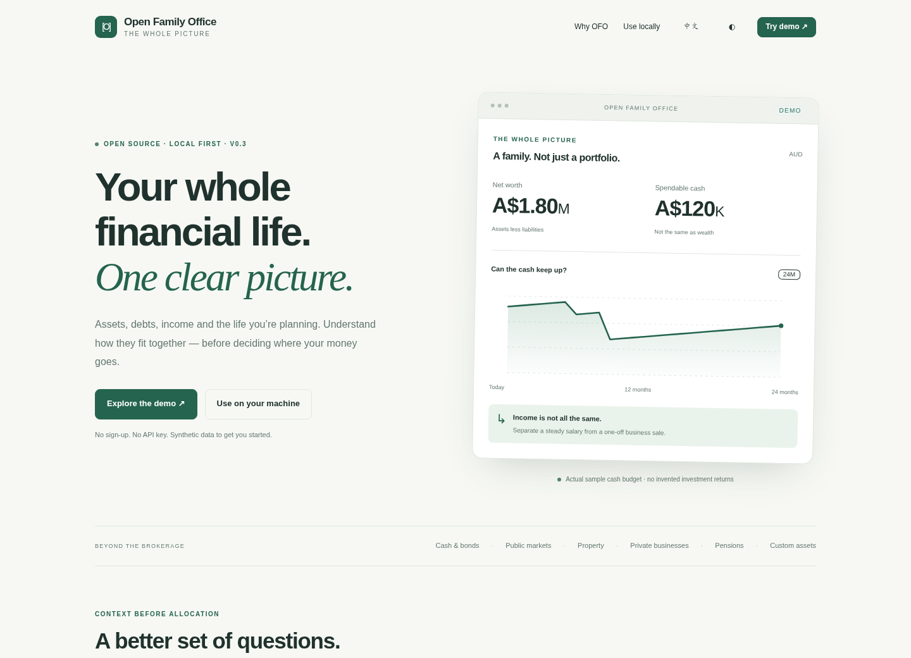

<p align="center"><strong>OPEN FAMILY OFFICE</strong><br>Family-office methods, open to everyone willing to own the setup.</p>

# Open Family Office

**Your portfolio is not your whole financial life.** Open Family Office is a local-first, open-source family wealth research toolkit for people and AI agents. It models the household around the portfolio: assets, debt, recurring and one-off income, liquidity, ownership, goals, scenarios and a separately declared liquid investment sleeve.

It is **not a SaaS account, broker or autonomous adviser**. The project keeps advanced capability — ownership look-through, Monte Carlo, optimization, provider adapters and MCP — while exposing a small task-oriented Skill surface to normal users.

[中文](README.zh-CN.md) · [Quick start](docs/QUICKSTART.md) · [Agent UX](docs/AGENT-UX.md) · [Data model](docs/DATA-MODEL.md) · [Integrations](docs/INTEGRATIONS.md) · [Roadmap](ROADMAP.md)



## Try it in 30 seconds

If you have [uv](https://docs.astral.sh/uv/):

```bash
uvx --from git+https://github.com/JamesbbBriz/open-family-office.git ofo demo --open
```

No Git clone, model account, API key or private data is required. The demo is synthetic.

## Install the CLI

```bash
uv tool install git+https://github.com/JamesbbBriz/open-family-office.git
ofo --version
ofo doctor
```

Create a private workspace:

```bash
ofo init ~/FamilyOffice
cd ~/FamilyOffice
ofo status
```

Then either open that folder in a file-aware AI agent and use **ofo-start**, or edit `household.json` yourself.

```bash
ofo validate
ofo overview --format markdown
ofo scenario scenarios/job-loss.json
ofo dashboard --out reports/review.html --open
```

The CLI discovers the workspace automatically, so normal commands do not require repeating long JSON paths.


## Skills are the user experience

The default agent surface is deliberately small:

| Skill | What the user is trying to do |
|---|---|
| **ofo-demo** | See what the project can do without private data |
| **ofo-start** | Build the first private household model |
| **ofo-update** | Add new statements, valuations or life changes |
| **ofo-overview** | Understand balance sheet, income durability and liquidity |
| **ofo-plan** | Build an investment policy and allocation framework |
| **ofo-scenario** | Test job loss, business sale, property shock, major purchase, etc. |
| **ofo-research** | Use providers, look-through or quantitative research deliberately |
| **ofo-dashboard** | Generate a private offline visual review |
| **ofo-review** | Review an earlier decision against new evidence |
| **ofo-doctor** | Diagnose installation, Skills, providers and MCP |

Underneath those Skills, granular workflows remain available to contributors.

```text
Skill
  ↓
canonical workflow
  ↓
deterministic ofo CLI / Python
  ↓
agent explanation
```

**Skills are the UX. MCP is optional plumbing.** MCP exposes a read-only tool subset for compatible hosts, but the project works without it.

## Private workspace, not private-by-marketing

`ofo init` creates the household workspace outside the public source repository and installs a portable agent kit there:

```text
FamilyOffice/
├── household.json
├── evidence/
├── imports/
├── scenarios/
├── reports/
├── .ofo/
├── .agents/skills/
├── .claude/skills/
├── .claude/commands/
└── agent/
    ├── workflows/
    ├── methodology/
    ├── schemas/
    └── templates/
```

After a CLI upgrade:

```bash
ofo agent sync
```

Unmodified managed files are upgraded. A Skill you changed yourself is reported as a conflict and **left untouched**.

Local-first is not the same thing as local inference or encryption. A cloud agent can still receive files you explicitly let it read. Private dashboards embed their data. See [SECURITY.md](SECURITY.md).

## What the engine understands

- attributable household assets and liabilities;
- recurring fixed, recurring variable and one-off cash flows;
- spendable liquidity versus locked or illiquid wealth;
- dated obligations and cash runway;
- business-sale and other event bridges;
- explicit ownership look-through and exposure dimensions;
- household investment-policy constraints;
- liquid-sleeve Monte Carlo and optimization with explicit assumptions;
- evidence-preserving, read-only provider adapters;
- standalone offline Plotly dashboards.

A home, private company or locked pension is **not** silently converted into a tradable ticker.

## Deterministic CLI

Common household commands:

```bash
ofo validate
ofo overview --format markdown
ofo cashflow --months 36 --format markdown
ofo scenario scenarios/business-sale.json
ofo allocation policy.json
ofo dashboard --out reports/review.html
```

Advanced research remains opt-in:

```bash
ofo providers
ofo fetch rba table --query '{"table":"f01"}' --allow-network --out evidence/rba-f01.json
ofo optimize returns.json --engine scipy --method min_variance
ofo simulate simulation.json
ofo lookthrough ownership.json
```

Historical observations, user views and model outputs are kept distinct. Optimizer weights are research output, not executable trading instructions.

## Optional MCP

Install MCP into the tool environment:

```bash
uv tool install --force --with 'mcp>=1.10,<2' git+https://github.com/JamesbbBriz/open-family-office.git
```

Then, inside a private workspace:

```bash
ofo mcp-config
```

The generated stdio server is confined to that workspace and exposes read-only tools.

## Architecture

```text
src/open_family_office/   installable deterministic engine + CLI
agent/workflows/          canonical financial procedures
agent/methodology/        interpretation rules
agent/schemas/            structured household inputs
.agents/skills/           canonical portable user-facing Skills
.claude/skills/           thin Claude discovery wrappers
web/src/                  daisyUI / Tailwind / Plotly source
public/                   generated static landing + synthetic demo
examples/                 synthetic reproducible fixtures
tests/                    accounting, integration, quant, CLI and web tests
```

Installed wheels bundle the demo, templates, agent kit and web resources. A user does **not** need the Git repository for normal CLI use.

## For contributors

Clone the repository when you want to change the project:

```bash
git clone https://github.com/JamesbbBriz/open-family-office.git
cd open-family-office
python -m venv .venv
. .venv/bin/activate
python -m pip install -e '.[analytics,documents]'
python -m unittest discover -s tests -v
node tests/sandbox.test.cjs
python scripts/release_check.py
```

Useful contributions include jurisdiction modules, pension/super models, data importers, provider fixtures, household edge cases, Skill improvements, accessibility fixes and reproducible quantitative research methods.

See [CONTRIBUTING.md](CONTRIBUTING.md).

## Project boundary

Open Family Office does not place trades, move money, log into banks, file tax returns or choose financial products on behalf of the user. It is a research and decision-support toolkit. Advanced methods remain useful only to the extent that their inputs and assumptions are useful.

MIT licensed. Third-party components keep their own notices in [THIRD_PARTY.md](THIRD_PARTY.md).
