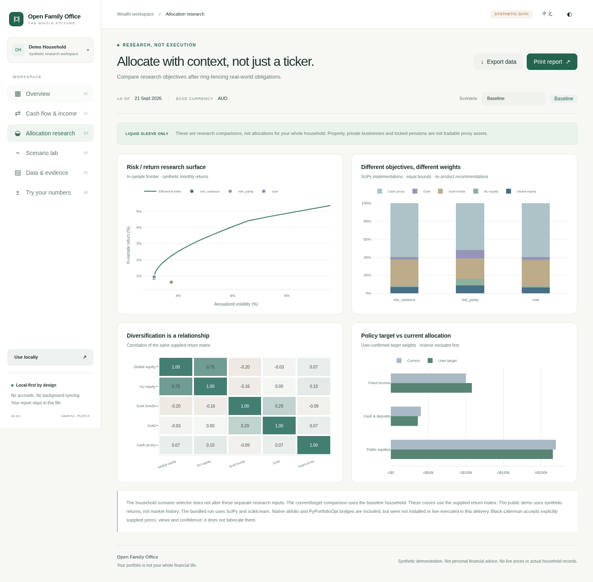

# Open Family Office — 家庭资产管理 Agent 工作区

**你的投资组合，不等于你的全部财务生活。**

这是一个本地优先、以业务方法论和 Agent Skills 为入口的家庭财富研究项目，不是炒股机器人。它把资产、债务、收入性质、未来现金需求、所有权关系和可流动投资部分的配置研究放在同一个工作区。

[English](README.md) · [升级与运行说明](docs/UPGRADE-v0.2.zh-CN.md) · [全部依赖与接入状态](docs/INTEGRATIONS.md) · [验收记录](docs/VALIDATION.md)


## 先看落地页，再体验 Demo

- `public/index.html`：简单落地页，介绍定位、在线体验、本地使用和源码下载。
- `public/demo.html`：原有13张研究图表，加上独立的浏览器现金试算图；共六个视图。
- `scripts/hh.py` 与 Agent Skills：本地完整工作流，使用自己的家庭数据、模型和可选数据源。

**线上与本地是同一套静态页面，不是两套产品。** 将 `public/` 发布到静态托管即可线上访问，下载后也能打开。需要页面互相跳转时，请保留两个HTML和downloads目录的相对位置。网页没有账号、模型后台、自动银行同步或交易功能。

新增“试算你的数字”：修改期初现金、持续收入、经营收入下降比例、支出、年度支出增长、一次性到账和出售月份，浏览器直接重算24个月现金。可以选择意外收入，或出售企业并停止经营收入。它与原有虚构家庭、优化器和蒙特卡洛研究独立，不会冒充全套模型重新计算。

[网站上线与本地使用](docs/WEB-DEPLOYMENT.zh-CN.md) · [v0.3验收](docs/VALIDATION-v0.3.md) · [设计系统](docs/DESIGN-SYSTEM.md)


## 先看图表

直接用支持 JavaScript 的浏览器打开 `public/demo.html`。图表库、编译后的 Tailwind CSS、应用代码和数据全部内嵌，无须 CDN、账户或 API Key。预览器不运行脚本时，保存后用浏览器打开。

六个视图：家庭总览、现金流与收入、资产配置研究、情景实验室、数据与证据、试算你的数字。包含 14 张交互图表、四种虚构情景、深浅色主题、核心界面中英文切换、JSON 导出和浏览器打印。

这是可重新生成的离线报告，不是实时行情网站。所有公开案例、收益序列和模拟假设均为虚构资料。报告不伪装成未来收益承诺。

## 一次安装完整工具集

建议 Python 3.12，并安装 Node.js/npm。在解压后的项目根目录运行：

```bash
python scripts/bootstrap.py --all
```

安装器创建 `.venv`，安装分析、量化、行情、PDF/OFX、MCP 依赖；另外创建 `.venv-openbb` 隔离 OpenBB；编译 Tailwind、生成图表报告、运行测试和检查依赖。任何一步失败都会停止，不会把后续步骤冒充完成。

**本次交付环境无法连接包仓库，完整安装命令没有在这里跑通。** 已经实际运行的是现有环境中的 NumPy、SciPy、scikit-learn、Plotly、pypdf 和核心计算；skfolio、PyPortfolioOpt、yfinance、OpenBB、ofxparse、MCP 的原生环境仍需安装后验证。联网接口的请求构造经过样例测试，但不等于在线授权或真实数据验证。

## 已经不只是 Markdown

本版保留家庭访谈、投资政策、决策复盘等方法论，增加了 13 个数据源适配器、三种可直接运行的 SciPy 优化目标、独立的 skfolio/PyPortfolioOpt 桥接、显式观点的 Black–Litterman 入口、相关性蒙特卡洛、所有权穿透与风险敞口汇总、PDF/OFX/CSV 输入工具，以及 7 个只读 MCP 工具。

数据源包括 SEC、FRED、RBA、ABS、OECD、IMF、CoinGecko、Yahoo/yfinance、OpenBB、Alpha Vantage、Finnhub、MarketData.app 和 MetalpriceAPI。每个接口的 Key、限制、验证程度都在接入矩阵里单独标明。

**“全部工具入口写好”不等于“所有服务已经获准使用”。** 商业数据授权、账户登录、密钥、真实接口验收和地区适用性不会被安装脚本绕过。Addepar、Wealthfolio 和 Ghostfolio 是设计参考，不是必须安装的运行依赖；没有复制其闭源代码或受限数据集。



## 资产广覆盖，计算有边界

房产、私人企业、养老金、私人信贷等都能进入家庭财务分析。优化器只接受明确指定的可流动代理资产，不会把家庭全部净资产当作可交易证券。当前净资产、月度现金预算、压力冲击和模拟路径分开展示。

例如虚构案例出售企业取得 90 万净现金，同时移除原先 60 万股权价值，停止每月 5,000 分配收入。事件带来的净财富变化是 30 万，而不是 90 万。现金改善与未来收入减少必须同时看。

## 隐私与发布

私人资料必须放在代码仓库外。离线 HTML 内含数据，因此私人报告不能公开上传。使用云端模型时，Agent 获准读取的资料可能发送给模型服务商。本地优先不等于加密，也不是安全认证。

GitHub 首页、Issue 模板、发布说明、推广文案、录屏脚本仍随仓库提供，见 `launch/`。没有自动创建公开仓库或代发帖子。实际验收范围见 [VALIDATION.md](docs/VALIDATION.md)，不要把未执行的原生 SDK 或宿主测试写进简历成果。

## 更名与兼容

产品名统一为 **Open Family Office**，仓库名建议 `open-family-office`。尚未确认商标、域名或GitHub名称是否可独占使用，也未代为购买或公开发布。

为了不破坏已有用法，Python内部导入仍叫 `household_cio`，CLI保留 `hh`，Skills保留 `hh-*`。对外页面、文案和包名称使用新品牌。页面使用经过改编并记录来源的daisyUI MIT组件子集，图表继续使用Plotly，不包含收费的daisyUI Charts模板包。
